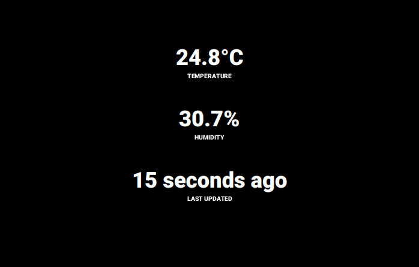

Runs on a Raspberry Pi w/ 10" screen.



### dev w/ vscode:
```
clj -M:repl:dev:scratch
```
Command palette (SHIFT+CTRL+P):   
**Calva: Connect to a running REPL server in your project**   
\> **Clojure CLI**
\> **localhost:xxxx**   

Load current file and dependencies: **CTRL+ALT+C + Enter**
Evaluate current form: **CTRL+Enter**

Nothing is evaluated on startup. Evaluate ns expression in app.scratch and start.

Experiment in scratch/scratch.clj

### test watch
```
clj -M:test/watch
```

### test
```
clj -M:test
```

### prod
```
# compile and build the jar
./package.sh
# copy jar to the device, stop old version if it's running and start the new version
./deploy.sh
```

### TODO: oauth & google drive
maybe helpful:
https://stackoverflow.com/questions/28078490/google-drive-oauth2-without-browser

### dev in Raspberry Pi (really slow, not worth)

Mount host machine directory to RPi
```
sshfs user@host:/host/directory /rpi/directory
```

- connect via SSH
- set the terminal session to use the RPi's display
- start the application in REPL
```
$ ssh user@host
$ export DISPLAY=:0
$ clj -M:repl:dev:scratch
```

Tunnel ports in another terminal window on host machine
```
$ ssh -L :<localport>:localhost:<remoteport> <remoteuser>@<remotehost> -p 22 -N -v
```

and connect to the REPL via editor!

### setup git hooks
```
./git-hooks/setup.sh
```

### other

Raspberry Pi cannot show a jpg image??? I wonder what the issue is. JavaFX?
https://www.raspberrypi.org/forums/viewtopic.php?t=291697

dropbox on RPi: https://github.com/andreafabrizi/Dropbox-Uploader
