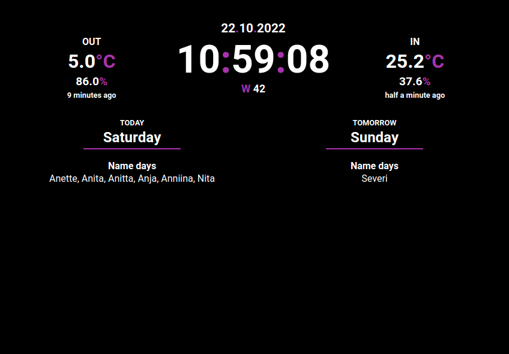

### app
the _home dashboard_ app, running on a Raspberry Pi, 11" screen



### more
MQTT broker runs on the Raspberry Pi.

Everything is contained within the local network.

---

Run this on raspberry pi:
```sh
$ mosquitto -p 1884 -d
```

Also run this on raspberry pi (zrcni/temperature-reader repo)
```sh
$ job.sh
```

and finally start home dashboard with app folder's start_remote.sh
